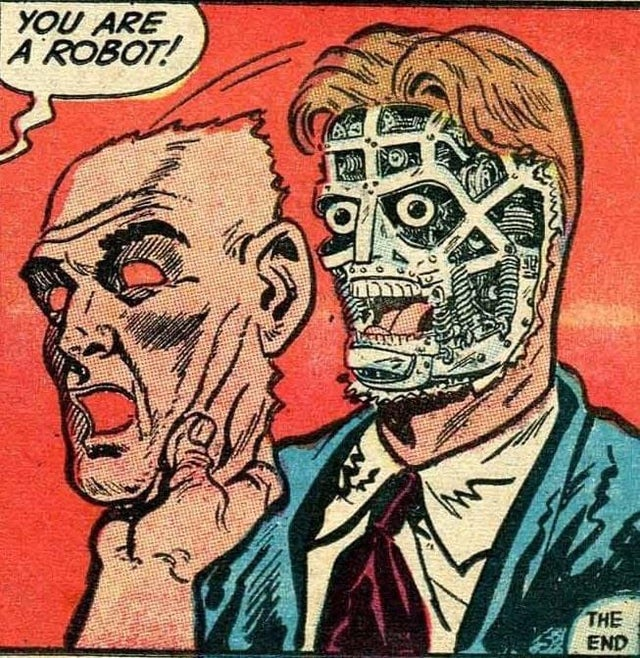

# ComicSlider
A new file conversion which allows you to read, store them online and search by writer, artist, year, plot, characters whilst 'not' counting towards cloud storage cost forever. [(unless uploaded after June 1st 2021)](https://blog.google/products/photos/storage-policy-update#:~:text=You%20can%20learn%20more%20about,storage%20provided%20through%20Google%20One.)
 
 
 ComicSlider converts eComics to PPTX, which you can then upload to Google Drive and have it automatially convert to Slides format.
 The Slides app has all the features of a eComics reader. Backwards/Forwards navigation, zooming and panning.

## Limitations

- PPTX pages are all the same size and orientation. Nothing can be done about that.
- The project is only useful until June 1st 2021 

## Features

- Supports CBZ and ZIP files
- Supports any data in XML files
- Will recreate entire folder structures and iterate over files
- Summary gets it own page because sometimes its huge
- [Web version (limited to 8mb files and doesn't have XML support yet)](http://cbz-to-pptx.com/)

## Future plans

- make exe version
- RAR, CBR format has some proprietary problems. Might come back to that.
- [Update website version to include XML formatting](http://cbz-to-pptx.com/)
- Create GUI

## How to run

assuming you have Python 3.* installed, to install the libraries

```pip install -r requirements.txt```

Then to convert any compatible file:
```
python Comic_Slider.py --filename "somecomic.cbz"  --outputfolder "somefolder"
```

or
```
python Comic_Slider.py --sourcefolder "somefolder"  --outputfolder "somefolder"
```

`Comic_Slider.py`
Main file 

`Comic_Slider_Utils.py`
Is mostly file management.

`Comic_Slider_Image.py`
Image and PPTX slide generation

